### Hi there 👋
# PhD Student Yuchao's Github

<!-- These cards are generated daily by a GitHub Action (soulteary/github-readme-stats-action)
     and committed into this repo as static SVGs, so they don't depend on any third-party server. -->

* 
* 

---

I am **Yuchao Su**, pursuing a Computer Science PhD at [**NC State University**](https://www.ncsu.edu/), Raleigh, USA.

I hold an Electrical & Computer Engineering Master's degree from [**Northeastern University**](https://www.northeastern.edu/), Boston, USA, and a Computer Science & Technology Bachelor's degree from [**Southeast University**](https://www.seu.edu.cn/), Nanjing, China.

* 🔭 I'm currently working on **HPC support for quantum simulation**
* 🔬 I'm currently focused on **quantum simulation and sparse linear algebra acceleration**
* 🌱 I'm currently learning **quantum computing and quantum machine learning**
* 👯 I'm looking to collaborate on **quantum-inspired optimization and quantum machine learning**
* 🧠 I have also researched **computer architecture, e.g. domain-specific accelerators**
* 😄 Pronouns: He/Him

---

📫 **How to reach me**

* 📨 **ysu34@ncsu.edu**
* 🌐 [**yuchaosu.com**](https://yuchaosu.com)
* 📄 [**CV**](https://yuchaosu.com/uploads/resume.pdf)

---

📚 **Skill Stack**

